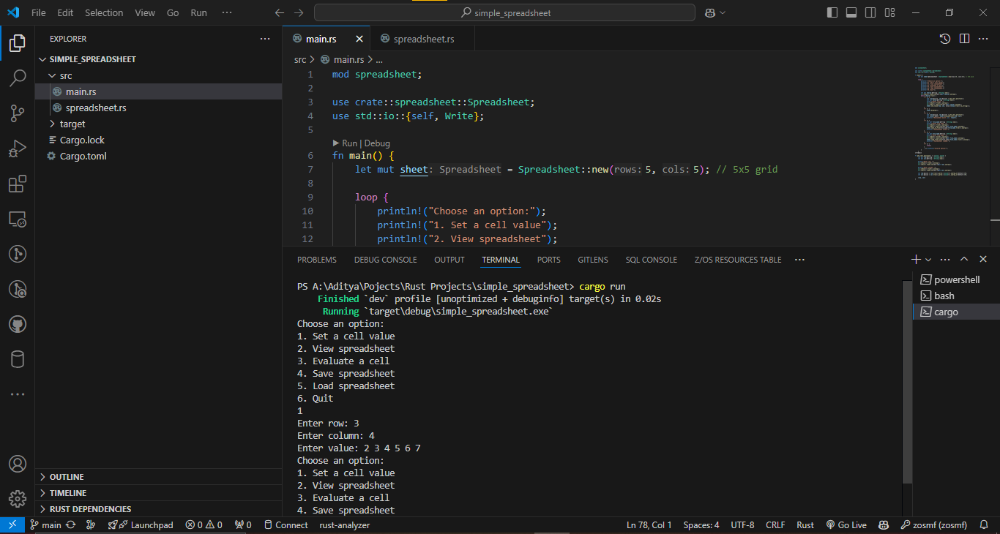

# Simple Spreadsheet Program

A basic command-line spreadsheet program built with Rust. It allows users to input values and formulas into a 2D grid, supports basic mathematical operations, and enables saving/loading of spreadsheets from files.

## Features

- **Cell Input**: Enter any string as a cell value, including formulas like `=2+3`.
- **Mathematical Operations**: Basic support for addition and subtraction formulas.
- **Display Spreadsheet**: View the current state of the spreadsheet as a grid.
- **Evaluate Formulas**: Automatically calculate the result of formulas in cells.
- **File-based Storage**: Save and load spreadsheets from CSV files.

## Getting Started

### Prerequisites

Ensure you have [Rust](https://www.rust-lang.org/tools/install) installed on your machine. You can verify your installation by running the following command:

```bash
rustc --version
```

## View


## Installation
1. Clone the repository or create a new Rust project:

```bash
cargo new simple_spreadsheet
cd simple_spreadsheet
```
2. Replace the contents of the src directory with the following files:

```bash
src/main.rs
src/spreadsheet.rs
```
3. Add the project metadata to the Cargo.toml file.

4. Running the Program
To run the program, execute the following command in your project directory:

```bash
cargo run
```

## Usage
Once the program is running, you can interact with the spreadsheet via the command-line interface:

1. Set a Cell Value:

- Select the option 1 and provide the row, column, and value (can be a number, string, or formula).
- Example: Setting cell (0, 0) to =2+3.

2. View the Spreadsheet:

- Select option 2 to display the current state of the grid.
  
3. Evaluate a Cell:

- Select option 3, provide the row and column of the cell to evaluate, and the result will be displayed.
- Example: If a cell contains the formula =2+3, the result 5 will be displayed.

4. Save the Spreadsheet:

- Select option 4, provide a filename, and the current spreadsheet will be saved to a file.

5. Load a Spreadsheet:

- Select option 5, provide the filename, and the program will load the data from the file into the spreadsheet.

6. Quit the Program:

- Select option 6 to exit the program.
  
## Example
Here's an example of how you can interact with the program:
```bash
Choose an option:
1. Set a cell value
2. View spreadsheet
3. Evaluate a cell
4. Save spreadsheet
5. Load spreadsheet
6. Quit
1
Enter row: 0
Enter column: 0
Enter value: =2+3

Choose an option:
1. Set a cell value
2. View spreadsheet
3. Evaluate a cell
4. Save spreadsheet
5. Load spreadsheet
6. Quit
3
Enter row: 0
Enter column: 0
Evaluated result: 5.0
```
